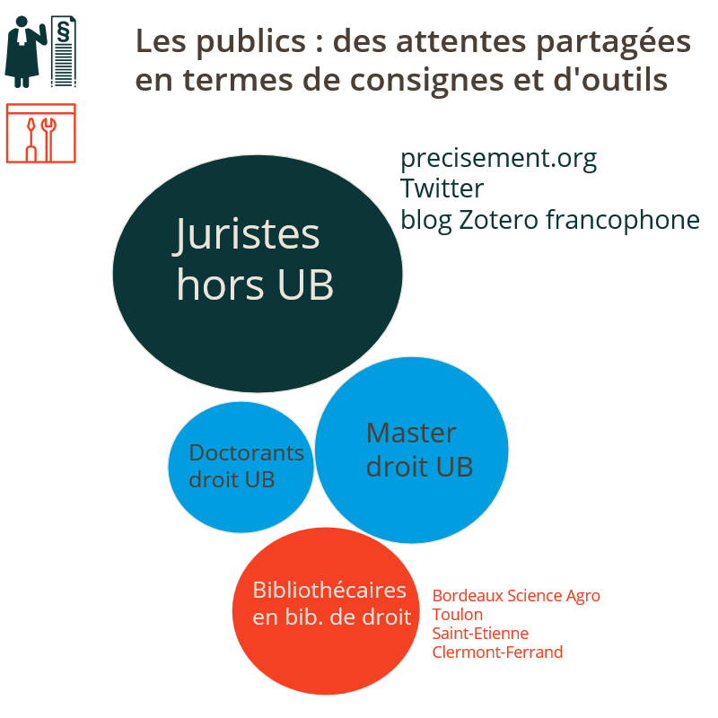

<!-- $theme: default-->
<!-- page_number: true -->
<!-- $size: 16:9 -->

# “Citer des références...” : répondre aux besoins bibliographiques d’une communauté
## Créer un style pour Zotero correspondant à des consignes bibliographiques : méthodes et outils

**Urfist Bordeaux**
17 juin 2019
<small>
*Frédérique Flamerie* 
*chargée de mission science ouverte/données de recherche*
*Université de Bordeaux - Direction de la documentation*
</small>

---

# Au programme

## 1. Pratique - TP
## 2. Création du style "Université de Bordeaux - Ecole doctorale de droit" en détails : les outils
## 3. Perspectives

---

# 1. Pratique - TP

Nous vous avons distribué un document imprimé respectant scrupuleusement les consignes du guide "Citer des références bibliographiques juridiques". Nous avons bien sûr utilisé l'extension de traitement de texte de Zotero pour insérer les citations et générer la bibliographie.

:open_file_folder: Vous trouverez dans le dossier commun :

:page_facing_up: un fichier Word **.docx** pour le texte de ce document,
:bookmark: un fichier Zotero **.rdf** pour les références bibliographiques citées.

Vous disposez de **45 minutes** pour produire le même résultat, en veillant à :

:pencil2: mettre à jour et corriger autant que nécessaire les références bibliographiques,
:pencil: utiliser à bon escient l'extension de traitement de texte Zotero pour Word.

:notebook_with_decorative_cover: La documentation complète du style est disponible en ligne sur ReadtheDocs : :link: [Documentation du style CSL - Université de Bordeaux - Ecole doctorale de droit](https://documentation-style-csl-ed-droit-ubx.readthedocs.io/en/latest/
)

---

# 2. Création du style : les outils

<!-- *footer : icône personnage par Miroslav Kurdov - CC-BY / icône outil par  popcornarts - CC-BY-NC - source : iconfinder.com -->

---

# 2. Outil 1 : GitHub

:link:  Le [projet csl_ed_droit_ubx sur GitHub](https://github.com/urfistbordeaux/csl_ed_droit_ubx)

* Centralisation et suivi des discussions grâce aux _issues_ ; :link: [exemple de la discussion sur la mention d'édition](https://github.com/urfistbordeaux/csl_ed_droit_ubx/issues/9)
* Ouverture à des contributions hors Université de Bordeaux et hors ESR
* Plateforme utilisée par CSL

---

# Outil 2 : bibliothèque de groupe Zotero

:link: La [page du groupe Zotero "style_csl_ed_droit_bx"](https://www.zotero.org/groups/2190104/style_csl_ed_droit_bx)

:book: La bibliothèque rassemble sous la forme de documents Zotero tous les exemples mentionnés dans la 1ère édition du guide, et en comporte de nouveaux créés pour la 2ème édition.

Elle est utile à la fois pour la **rédaction du code** et pour **l'utilisation du style**.

* **Rédaction du code** : on peut ainsi s'assurer aisément de transposer correctement en CSL les consignes. Le recours à des exemples préexistants facilite également le dialogue et les échanges avec les auteurs des consignes.
* **Utilisation du style** : on dispose de modèles pour saisir correctement les documents dans sa bibliothèque, de façon à ce que toutes les informations soient saisies sous la forme appropriée et dans le champ adapté (directeur de thèse, titre abrégé de mélange par exemple)

---

# Outil 3 : ReadtheDocs

:notebook_with_decorative_cover: La [documentation du style CSL - Université de Bordeaux - Ecole doctorale de droit](https://documentation-style-csl-ed-droit-ubx.readthedocs.io/en/latest/) constitue une version augmentée du guide "Citer des références bibliographiques juridiques".

* Elle comporte des indications pour le paramétrage et l'usage de Zotero, ainsi que des notes d'application générales communes à tous les types de document, à partir notamment des "Recommandations particulières" du guide  - :link: [section "Lisez-moi"](https://documentation-style-csl-ed-droit-ubx.readthedocs.io/en/latest/notes.html).
* Pour chaque type de document, elle intègre des notes d'application dans Zotero et pour chaque exemple le lien vers le document correspondant dans la bibliothèque de groupe - :link: [section "Modèles de citation des différents types de documents"](https://documentation-style-csl-ed-droit-ubx.readthedocs.io/en/latest/guide.html).
* Elle est versionnable et disponible au format html et au format pdf.

---

# Outil 4 : Editeur CSL Zotero + éditeur de texte

Pour en savoir plus sur les outils d'édition des styles CSL :

COLLECTIF, « Quel outil pour éditer des styles CSL? », sur _Le blog Zotero francophone_ [en ligne], publié le 15 janvier 2018, [consulté le 5 juin 2019]. https://zotero.hypotheses.org/758

---

# Perspectives

:construction: Intégrer de nouveaux types de document : jugements et arrêts et codes  à partir de la version actuelle du guide, autres documents en fonction des demandes soumises - :link: [Le projet sur GitHub : page Contribuer au projet > Demander la prise en compte d'un nouveau type de document](https://github.com/urfistbordeaux/csl_ed_droit_ubx/wiki/Contribuer-au-projet#demander-la-prise-en-compte-dun-nouveau-type-de-document)

:school: Utiliser les ressources du style (documentation  + bibliothèque de groupe) en formation pour sensibiliser les usagers à la qualité des données bibliographiques de leur bibliothèque Zotero ?

:telephone_receiver: Répondre à de nouvelles demandes ?

:zap: Rappel - addendum : rechercher un style : :link: [Support de formation "Créer des styles bibliographiques CSL" >  Rechercher un style à partir de caractéristiques précises](https://github.com/fflamerie/zotero_csl_2018/blob/2018_12/content/2018_csl_cours.md#rechercher-un-style-%C3%A0-partir-de-caract%C3%A9ristiques-pr%C3%A9cises)

---

# Des :interrobang:
# Des :bulb:

---

# Merci de votre attention
 

:email: frederique.flamerie-de-lachapelle@u-bordeaux.fr
:telephone_receiver: 05.40.00.89.91

 

 [orcid.org/0000-0001-6014-0134](https://orcid.org/0000-0001-6014-0134)

